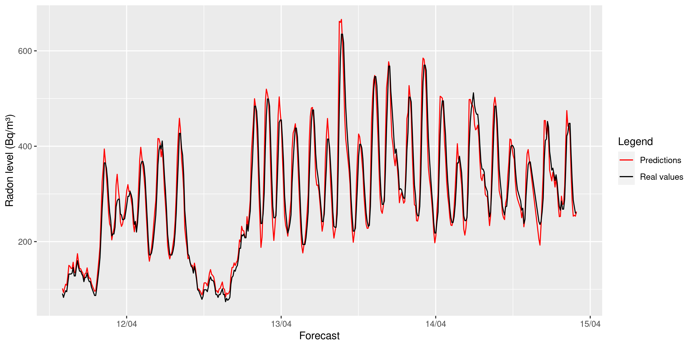

# Radon level forecasting using LSTM models

This work builds a simple LSTM model that it is able to predict the radon levels using only the radon itself and the ventilation
status in the room it is monitorized. It has below 15Bq/m3 of RMSE and the next figure shows a the model forecasting prediction.



The repository structure is the following

```
├── data
│   ├── predictions.csv
│   └── radon-data.csv
├── figures
│   └── // figures used, drawed with src/plots.R
├── README.md
└── src
    ├── LSTM-models.ipynb
    ├── plots.R
    ├── requirements.txt
    └── utils
        └── // Useful functions
```

## Depoyment with docker
Start the container as follows:
```bash
docker build -t radon_predictions .
docker run -p 8500:8500 --name radon radon_predictions
```

To submit data to predict new radon levels, there is an example in [sample_predictions.py](https://github.com/valcarce01/radon-prediction/blob/main/sample_predictions.py) using python requests.

Then, to stop the container: `docker stop radon`. For further configuration, navigate the docker documentation.

